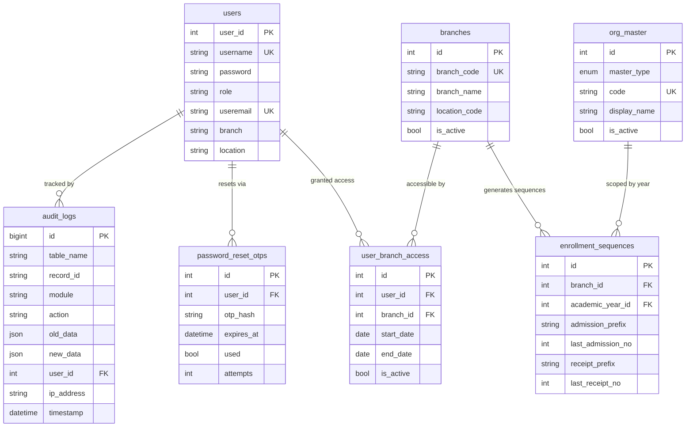
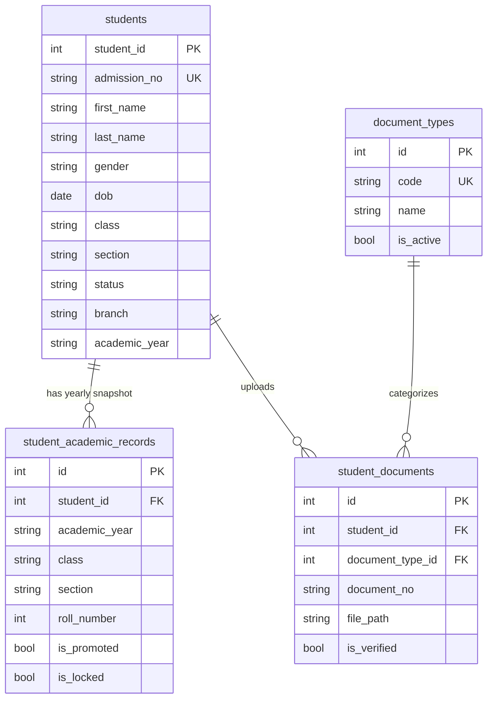
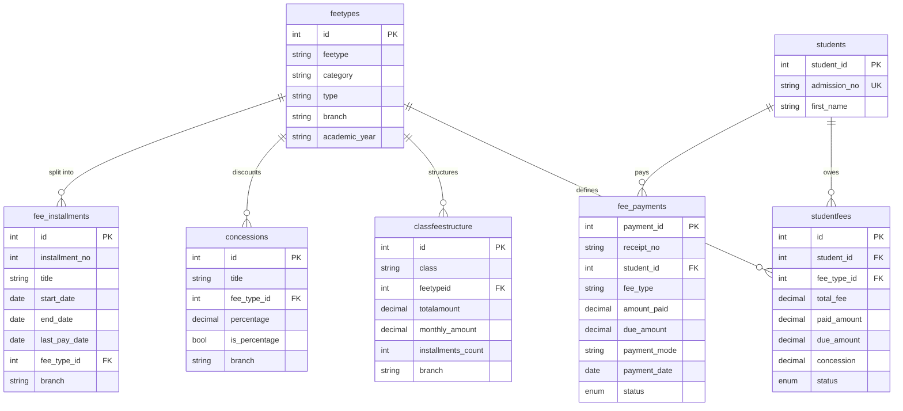
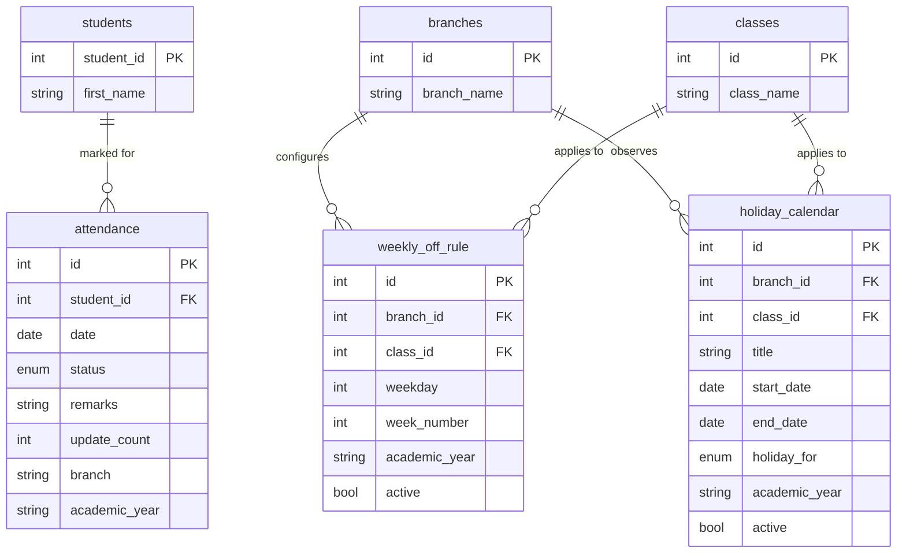

# Entity-Relationship (ER) Diagram

## MS Hifz Academy ERP System — Database Schema

**Version:** 1.0  
**Last Updated:** April 24, 2026  
**Total Tables:** 25 (+ 1 Audit Log table)

---

## Table of Contents

1. [ER Diagram (Full)](#er-diagram-full)
2. [Module-Wise Breakdown](#module-wise-breakdown)
   - [System & Organization Module](#1-system--organization-module)
   - [Student Module](#2-student-module)
   - [Fee Module](#3-fee-module)
   - [Attendance Module](#4-attendance-module)
   - [Academics Module](#5-academics-module)
3. [Table Reference](#table-reference)
4. [Data Flow Overview](#data-flow-overview)

---

## ER Diagram (Full)

```mermaid
erDiagram

    %% =============================================
    %% SYSTEM & ORGANIZATION MODULE
    %% =============================================

    users {
        int user_id PK
        string username UK
        string password
        string role
        string useremail UK
        string branch
        string location
        datetime created_at
        datetime updated_at
        int created_by FK
        int updated_by FK
    }

    audit_logs {
        bigint id PK
        string table_name
        string record_id
        string module
        string action
        json old_data
        json new_data
        int user_id FK
        string ip_address
        datetime timestamp
    }

    password_reset_otps {
        int id PK
        int user_id FK
        string otp_hash
        datetime expires_at
        bool used
        int attempts
    }

    org_master {
        int id PK
        enum master_type
        string code UK
        string display_name
        bool is_active
    }

    branches {
        int id PK
        string branch_code UK
        string branch_name
        string location_code
        bool is_active
    }

    user_branch_access {
        int id PK
        int user_id FK
        int branch_id FK
        date start_date
        date end_date
        bool is_active
    }

    enrollment_sequences {
        int id PK
        int branch_id FK
        int academic_year_id FK
        string admission_prefix
        int last_admission_no
        string receipt_prefix
        int last_receipt_no
    }

    %% =============================================
    %% STUDENT MODULE
    %% =============================================

    students {
        int student_id PK
        string admission_no UK
        string first_name
        string last_name
        string gender
        date dob
        string phone
        string email
        string class
        string section
        string status
        string branch
        string location
        string academic_year
    }

    student_academic_records {
        int id PK
        int student_id FK
        string academic_year
        string class
        string section
        int roll_number
        bool is_promoted
        bool is_locked
    }

    document_types {
        int id PK
        string code UK
        string name
        string description
        bool is_active
    }

    student_documents {
        int id PK
        int student_id FK
        int document_type_id FK
        string document_no
        string file_path
        bool is_verified
    }

    %% =============================================
    %% FEE MODULE
    %% =============================================

    feetypes {
        int id PK
        string feetype
        string category
        string feetypegroup
        string type
        string branch
        string location
        string academic_year
    }

    studentfees {
        int id PK
        int student_id FK
        int fee_type_id FK
        string academic_year
        string month
        decimal total_fee
        decimal paid_amount
        decimal due_amount
        decimal concession
        enum status
        bool is_active
    }

    classfeestructure {
        int id PK
        string class
        int feetypeid FK
        decimal totalamount
        decimal monthly_amount
        int installments_count
        bool isnewadmission
        string branch
        string location
        string academic_year
    }

    concessions {
        int id PK
        string title
        int fee_type_id FK
        decimal percentage
        bool is_percentage
        string branch
        string location
        string academic_year
    }

    fee_installments {
        int id PK
        int installment_no
        string title
        date start_date
        date end_date
        date last_pay_date
        int fee_type_id FK
        string branch
        string academic_year
    }

    fee_payments {
        int payment_id PK
        string receipt_no
        int student_id FK
        string class
        string section
        string fee_type
        decimal gross_amount
        decimal concession_amount
        decimal net_payable
        decimal amount_paid
        decimal due_amount
        string payment_mode
        date payment_date
        enum status
        string branch
        string academic_year
    }

    %% =============================================
    %% ATTENDANCE MODULE
    %% =============================================

    attendance {
        int id PK
        int student_id FK
        date date
        enum status
        string remarks
        string branch
        string academic_year
    }

    weekly_off_rule {
        int id PK
        int branch_id FK
        int class_id FK
        int weekday
        int week_number
        string academic_year
        bool active
    }

    holiday_calendar {
        int id PK
        int branch_id FK
        int class_id FK
        string title
        date start_date
        date end_date
        enum holiday_for
        string academic_year
        bool active
    }

    %% =============================================
    %% ACADEMICS MODULE
    %% =============================================

    classes {
        int id PK
        string class_name UK
        string location
        string branch
    }

    class_sections {
        int id PK
        int class_id FK
        int branch_id FK
        string academic_year
        string section_name
        int student_strength
        bool is_active
    }

    subjectmaster {
        int id PK
        string subject_name
        string subject_name_urdu
        enum subject_type
        string academic_year
        bool is_active
    }

    classsubjectassignment {
        int id PK
        int class_id
        int subject_id
        string academic_year
        string location_name
        string branch_name
    }

    studentsubjectassignment {
        int id PK
        int student_id FK
        int subject_id FK
        string academic_year
        string branch
        bool status
    }

    testtype {
        int id PK
        string test_name
        int max_marks
        int display_order
        string academic_year
        bool is_active
    }

    test_attendance_months {
        int id PK
        int test_id FK
        string branch
        int class_id
        string academic_year
        int month
        int year
    }

    class_test {
        int id PK
        string academic_year
        string branch
        string location
        int class_id
        int test_id
        int test_order
        bool status
    }

    class_test_subjects {
        int id PK
        int class_test_id FK
        int subject_id FK
        int max_marks
        int subject_order
    }

    student_test_assignments {
        int id PK
        int student_id FK
        int class_test_id FK
        string academic_year
        string branch
        bool status
    }

    grade_scales {
        int id PK
        string scale_name
        string scale_description
        string location
        string branch
        string academic_year
        int total_marks
        bool is_active
    }

    grade_scale_details {
        int id PK
        int grade_scale_id FK
        string grade
        int min_marks
        int max_marks
        string description
        bool is_active
    }

    student_marks {
        int id PK
        int student_id FK
        int class_test_id FK
        int subject_id FK
        decimal marks_obtained
        bool is_absent
        string academic_year
        string branch
        int class_id
        string section
    }

    %% =============================================
    %% RELATIONSHIPS
    %% =============================================

    %% --- System Relationships ---
    users ||--o{ audit_logs : "tracked by"
    users ||--o{ password_reset_otps : "has"
    users ||--o{ user_branch_access : "granted"
    branches ||--o{ user_branch_access : "assigned to"
    branches ||--o{ enrollment_sequences : "generates"
    org_master ||--o{ enrollment_sequences : "scoped by year"

    %% --- Student Core ---
    students ||--o{ student_academic_records : "has yearly"
    students ||--o{ student_documents : "uploads"
    document_types ||--o{ student_documents : "categorizes"

    %% --- Fee Relationships ---
    feetypes ||--o{ studentfees : "defines"
    students ||--o{ studentfees : "owes"
    feetypes ||--o{ classfeestructure : "structures"
    feetypes ||--o{ concessions : "discounts"
    feetypes ||--o{ fee_installments : "split into"
    students ||--o{ fee_payments : "pays"

    %% --- Attendance Relationships ---
    students ||--o{ attendance : "recorded"
    branches ||--o{ weekly_off_rule : "configures"
    classes ||--o{ weekly_off_rule : "applies to"
    branches ||--o{ holiday_calendar : "observes"
    classes ||--o{ holiday_calendar : "applies to"

    %% --- Academics Relationships ---
    classes ||--o{ class_sections : "divided into"
    branches ||--o{ class_sections : "located at"
    students ||--o{ studentsubjectassignment : "enrolled in"
    subjectmaster ||--o{ studentsubjectassignment : "assigned"
    testtype ||--o{ test_attendance_months : "tracks months"
    class_test ||--o{ class_test_subjects : "includes"
    subjectmaster ||--o{ class_test_subjects : "tested in"
    students ||--o{ student_test_assignments : "assigned to"
    class_test ||--o{ student_test_assignments : "assigned"
    students ||--o{ student_marks : "scores"
    class_test ||--o{ student_marks : "evaluated in"
    subjectmaster ||--o{ student_marks : "graded for"
    grade_scales ||--o{ grade_scale_details : "contains"
```



---

## Module-Wise Breakdown

### 1. System & Organization Module



**Tables & Roles:**

| Table | Purpose | Primary Key |
|-------|---------|-------------|
| `users` | Stores all system users (Admin, Teacher, Finance, etc.) | `user_id` |
| `audit_logs` | Immutable log of every CREATE, UPDATE, DELETE across the system | `id` |
| `password_reset_otps` | Temporary OTP records for password recovery | `id` |
| `org_master` | Master reference for locations and academic years | `id` |
| `branches` | Physical school branches/campuses | `id` |
| `user_branch_access` | Maps which users can access which branches (RBAC) | `id` |
| `enrollment_sequences` | Auto-incrementing admission and receipt numbers per branch/year | `id` |

**Key Relationships:**
- A **User** can have access to **many Branches** via `user_branch_access` (many-to-many through junction table)
- Each **Branch** + **Academic Year** combination has one **Enrollment Sequence** for generating unique admission and receipt numbers
- Every data modification across the system is captured in **`audit_logs`** with before/after snapshots

---

### 2. Student Module



**Tables & Roles:**

| Table | Purpose | Primary Key |
|-------|---------|-------------|
| `students` | Master record for every enrolled student (personal, parent, guardian info) | `student_id` |
| `student_academic_records` | Yearly snapshot of a student's class, section, promotion status | `id` |
| `document_types` | Master list of accepted document categories (e.g., Aadhaar, Birth Certificate) | `id` |
| `student_documents` | Uploaded documents linked to individual students | `id` |

**Key Relationships:**
- Each **Student** has **one record per academic year** in `student_academic_records` (enforced by unique constraint on `student_id` + `academic_year`)
- A **Student** can upload **multiple documents**, each categorized by a **DocumentType**
- `student_academic_records` captures **promotion/demotion history** and can be **locked** to prevent edits to finalized years

---

### 3. Fee Module



**Tables & Roles:**

| Table | Purpose | Primary Key |
|-------|---------|-------------|
| `feetypes` | Master definition of fee categories (Tuition, Transport, etc.) | `id` |
| `classfeestructure` | Template linking fee types to classes with amounts | `id` |
| `fee_installments` | Defines payment schedule (monthly, quarterly, etc.) | `id` |
| `studentfees` | Individual fee obligations assigned to each student | `id` |
| `concessions` | Discount rules (percentage or flat) per fee type | `id` |
| `fee_payments` | Actual payment transactions with receipt numbers | `payment_id` |

**Key Relationships:**
- **FeeType** is the central entity — it drives fee structures, installments, concessions, and student fee records
- **ClassFeeStructure** defines the _template_ (how much each class pays per fee type)
- **StudentFee** is the _individualized_ obligation per student per fee type/month
- **FeePayment** records actual money collected — one receipt can have **multiple line items** (grouped by `receipt_no`)
- **Concessions** can be percentage-based or flat amounts, linked to specific fee types

---

### 4. Attendance Module



**Tables & Roles:**

| Table | Purpose | Primary Key |
|-------|---------|-------------|
| `attendance` | Daily attendance record per student (Present/Absent) | `id` |
| `weekly_off_rule` | Configurable weekly holidays per branch (e.g., every Friday, 2nd Saturday) | `id` |
| `holiday_calendar` | Named holidays with date ranges (can be student-only, staff-only, or all) | `id` |

**Key Relationships:**
- Each **Student** has at most **one attendance record per day** (enforced by unique constraint)
- **WeeklyOffRule** and **HolidayCalendar** are both scoped to **Branch** and optionally to a specific **Class** (NULL `class_id` means it applies to all classes)
- These rules drive validation — the system prevents attendance marking on configured off-days

---

### 5. Academics Module

```mermaid
erDiagram
    classes ||--o{ class_sections : "divided into"
    branches ||--o{ class_sections : "located at"
    students ||--o{ studentsubjectassignment : "enrolled in"
    subjectmaster ||--o{ studentsubjectassignment : "assigned"
    testtype ||--o{ test_attendance_months : "tracks months"
    class_test ||--o{ class_test_subjects : "includes"
    subjectmaster ||--o{ class_test_subjects : "tested in"
    students ||--o{ student_test_assignments : "assigned"
    class_test ||--o{ student_test_assignments : "for test"
    students ||--o{ student_marks : "scores"
    class_test ||--o{ student_marks : "evaluated in"
    subjectmaster ||--o{ student_marks : "graded for"
    grade_scales ||--o{ grade_scale_details : "contains"

    classes {
        int id PK
        string class_name UK
        string location
        string branch
    }

    class_sections {
        int id PK
        int class_id FK
        int branch_id FK
        string academic_year
        string section_name
        int student_strength
        bool is_active
    }

    subjectmaster {
        int id PK
        string subject_name
        string subject_name_urdu
        enum subject_type
        string academic_year
        bool is_active
    }

    classsubjectassignment {
        int id PK
        int class_id
        int subject_id
        string academic_year
        string branch_name
    }

    studentsubjectassignment {
        int id PK
        int student_id FK
        int subject_id FK
        string academic_year
        bool status
    }

    testtype {
        int id PK
        string test_name
        int max_marks
        int display_order
        string academic_year
        bool is_active
    }

    test_attendance_months {
        int id PK
        int test_id FK
        string branch
        int class_id
        string academic_year
        int month
        int year
    }

    class_test {
        int id PK
        string academic_year
        string branch
        int class_id
        int test_id
        int test_order
        bool status
    }

    class_test_subjects {
        int id PK
        int class_test_id FK
        int subject_id FK
        int max_marks
        int subject_order
    }

    student_test_assignments {
        int id PK
        int student_id FK
        int class_test_id FK
        string academic_year
        bool status
    }

    grade_scales {
        int id PK
        string scale_name
        int total_marks
        string academic_year
        bool is_active
    }

    grade_scale_details {
        int id PK
        int grade_scale_id FK
        string grade
        int min_marks
        int max_marks
        bool is_active
    }

    student_marks {
        int id PK
        int student_id FK
        int class_test_id FK
        int subject_id FK
        decimal marks_obtained
        bool is_absent
        string academic_year
    }
```



**Tables & Roles:**

| Table | Purpose | Primary Key |
|-------|---------|-------------|
| `classes` | Global class name master (e.g., "Class 1", "Class 10") | `id` |
| `class_sections` | Branch-specific instances of classes with sections (A, B, C) | `id` |
| `subjectmaster` | Master list of subjects (Hifz and Academic types) | `id` |
| `classsubjectassignment` | Maps which subjects are taught in which class/branch | `id` |
| `studentsubjectassignment` | Individual student-level subject enrollment | `id` |
| `testtype` | Defines test categories (Unit Test, Mid-Term, Final, etc.) | `id` |
| `test_attendance_months` | Maps tests to specific months for attendance-based evaluation | `id` |
| `class_test` | Assigns a test type to a specific class in a branch | `id` |
| `class_test_subjects` | Which subjects are included in a class test with max marks | `id` |
| `student_test_assignments` | Assigns individual students to tests | `id` |
| `grade_scales` | Grading system definitions (e.g., CBSE, Custom) | `id` |
| `grade_scale_details` | Grade bands within a scale (A+: 90-100, A: 80-89, etc.) | `id` |
| `student_marks` | Actual marks scored by students per test per subject | `id` |

**Key Relationships:**
- **ClassMaster** → **ClassSection**: A global class is instantiated per branch with sections
- **SubjectMaster** → **ClassSubjectAssignment** → **StudentSubjectAssignment**: Subjects flow from master → class-level → student-level
- **TestType** → **ClassTest** → **ClassTestSubject**: Tests flow from type definition → class assignment → subject breakdown
- **StudentMarks** is the final intersection: links **Student** × **ClassTest** × **Subject** with actual scores
- **GradeScale** → **GradeScaleDetails**: Configurable grading bands used to convert marks to grades

---

## Table Reference

### All Tables with Foreign Keys

| # | Table Name | Primary Key | Foreign Keys |
|---|-----------|-------------|--------------|
| 1 | `users` | `user_id` | `created_by` → `users.user_id`, `updated_by` → `users.user_id` |
| 2 | `audit_logs` | `id` | `user_id` → `users.user_id` |
| 3 | `password_reset_otps` | `id` | `user_id` → `users.user_id` |
| 4 | `org_master` | `id` | — |
| 5 | `branches` | `id` | — |
| 6 | `user_branch_access` | `id` | `user_id` → `users.user_id`, `branch_id` → `branches.id` |
| 7 | `enrollment_sequences` | `id` | `branch_id` → `branches.id`, `academic_year_id` → `org_master.id` |
| 8 | `students` | `student_id` | — |
| 9 | `student_academic_records` | `id` | `student_id` → `students.student_id` |
| 10 | `document_types` | `id` | — |
| 11 | `student_documents` | `id` | `student_id` → `students.student_id`, `document_type_id` → `document_types.id` |
| 12 | `classes` | `id` | — |
| 13 | `class_sections` | `id` | `class_id` → `classes.id`, `branch_id` → `branches.id` |
| 14 | `feetypes` | `id` | — |
| 15 | `studentfees` | `id` | `student_id` → `students.student_id`, `fee_type_id` → `feetypes.id` |
| 16 | `classfeestructure` | `id` | `feetypeid` → `feetypes.id` |
| 17 | `concessions` | `id` | `fee_type_id` → `feetypes.id` |
| 18 | `fee_installments` | `id` | `fee_type_id` → `feetypes.id` |
| 19 | `fee_payments` | `payment_id` | `student_id` → `students.student_id` |
| 20 | `attendance` | `id` | `student_id` → `students.student_id` |
| 21 | `weekly_off_rule` | `id` | `branch_id` → `branches.id`, `class_id` → `classes.id` |
| 22 | `holiday_calendar` | `id` | `branch_id` → `branches.id`, `class_id` → `classes.id` |
| 23 | `subjectmaster` | `id` | — |
| 24 | `classsubjectassignment` | `id` | — (logical refs to `classes.id` and `subjectmaster.id`) |
| 25 | `studentsubjectassignment` | `id` | `student_id` → `students.student_id`, `subject_id` → `subjectmaster.id` |
| 26 | `testtype` | `id` | — |
| 27 | `test_attendance_months` | `id` | `test_id` → `testtype.id` |
| 28 | `class_test` | `id` | — (logical refs to `classes.id` and `testtype.id`) |
| 29 | `class_test_subjects` | `id` | `class_test_id` → `class_test.id`, `subject_id` → `subjectmaster.id` |
| 30 | `student_test_assignments` | `id` | `student_id` → `students.student_id`, `class_test_id` → `class_test.id` |
| 31 | `grade_scales` | `id` | — |
| 32 | `grade_scale_details` | `id` | `grade_scale_id` → `grade_scales.id` |
| 33 | `student_marks` | `id` | `student_id` → `students.student_id`, `class_test_id` → `class_test.id`, `subject_id` → `subjectmaster.id` |

---

## Data Flow Overview

### Overall Architecture

```
┌──────────────────────────────────────────────────────────────────────┐
│                        SYSTEM LAYER                                  │
│  org_master ──► branches ──► user_branch_access ◄── users            │
│                    │                                   │              │
│                    ▼                                   ▼              │
│          enrollment_sequences                    audit_logs           │
│          (admission/receipt #s)              password_reset_otps      │
└──────────────────────┬───────────────────────────────────────────────┘
                       │
        ┌──────────────┼──────────────┐
        ▼              ▼              ▼
┌──────────────┐ ┌───────────┐ ┌────────────────┐
│   STUDENTS   │ │   FEES    │ │   ACADEMICS    │
│              │ │           │ │                │
│  students ───┼─► studentfees│ │  classes       │
│      │       │ │     ▲     │ │    │           │
│      ▼       │ │     │     │ │    ▼           │
│  academic    │ │ feetypes   │ │ class_sections │
│  records     │ │  │  │  │  │ │                │
│      │       │ │  ▼  ▼  ▼  │ │ subjectmaster  │
│      ▼       │ │ fee  con- │ │    │           │
│  documents   │ │ struct cess│ │    ▼           │
│              │ │  │       │ │ class/student   │
│              │ │  ▼       │ │ subject assign  │
│              │ │ install-  │ │                │
│              │ │ ments     │ │ testtype        │
│              │ │           │ │    │           │
│              │ │ fee_      │ │    ▼           │
│              │ │ payments  │ │ class_test ──► │
│              │ │           │ │ test_subjects  │
│              │ │           │ │    │           │
│              │ │           │ │    ▼           │
│              │ │           │ │ student_marks  │
│              │ │           │ │                │
│              │ │           │ │ grade_scales   │
│              │ │           │ │    │           │
│              │ │           │ │    ▼           │
│              │ │           │ │ grade_details  │
└──────────────┘ └───────────┘ └────────────────┘
        │              │              │
        ▼              ▼              ▼
┌──────────────────────────────────────────────────────────────────────┐
│                      ATTENDANCE LAYER                                │
│   attendance ◄── students                                            │
│   weekly_off_rule ◄── branches + classes                             │
│   holiday_calendar ◄── branches + classes                            │
└──────────────────────────────────────────────────────────────────────┘
```

### Data Flow Narratives

#### 1. Student Enrollment Flow
```
Branch Setup → Class/Section Creation → Student Registration → Academic Record Created
                                              │
                                              ▼
                                     Subject Assignment → Test Assignment
                                              │
                                              ▼
                                        Fee Allocation
```

1. **Admin** sets up `org_master` (locations, academic years) and `branches`
2. **Classes** are created globally, then **ClassSections** are instantiated per branch
3. **Student** is registered with personal, parent, and guardian details
4. A **StudentAcademicRecord** is created for the current academic year
5. **Subjects** are assigned at class-level, then at student-level
6. **Fee types** are allocated based on **ClassFeeStructure** templates

#### 2. Fee Collection Flow
```
FeeType → ClassFeeStructure → StudentFee (individual obligation)
                                    │
                            Apply Concession (if any)
                                    │
                                    ▼
                            FeePayment (actual collection)
                                    │
                                    ▼
                            Receipt Generated (enrollment_sequences)
```

1. **FeeType** defines categories (Tuition, Transport, Lab, etc.)
2. **ClassFeeStructure** sets the amount per class per fee type
3. **StudentFee** records are generated for each student (can be monthly installments)
4. **Concessions** reduce the payable amount (percentage or flat)
5. **FeePayment** captures the actual transaction — multiple line items share one `receipt_no`
6. Receipt numbers auto-increment via **EnrollmentSequences**

#### 3. Academic Grading Flow
```
TestType → ClassTest (assign to class) → ClassTestSubject (add subjects)
                                              │
                                              ▼
                                    StudentTestAssignment (assign to students)
                                              │
                                              ▼
                                    StudentMarks (enter scores)
                                              │
                                              ▼
                                    GradeScale → Grade Conversion
```

1. **TestType** defines exam categories (Unit Test 1, Mid-Term, Final, etc.)
2. **ClassTest** assigns a test to a specific class in a branch
3. **ClassTestSubject** specifies which subjects are in the test and their max marks
4. **StudentTestAssignment** assigns individual students to the test
5. **StudentMarks** stores the actual scores per student per subject per test
6. **GradeScale** + **GradeScaleDetails** convert raw marks to letter grades

#### 4. Attendance Flow
```
WeeklyOffRule + HolidayCalendar → Validate working day
                                       │
                                       ▼
                                  Mark Attendance (per student per day)
                                       │
                                       ▼
                                  Generate Reports
```

1. **WeeklyOffRule** defines recurring off-days (e.g., every Friday, 2nd & 4th Saturday)
2. **HolidayCalendar** defines named holidays with date ranges
3. The system validates whether a given date is a working day before allowing attendance
4. **Attendance** records are created per student per day (enforced unique constraint)

---

### Shared Patterns Across All Tables

| Pattern | Description |
|---------|-------------|
| **AuditMixin** | All tables (except `audit_logs`) include `created_at`, `updated_at`, `created_by`, `updated_by` — automatically populated via SQLAlchemy event listeners |
| **Branch Segregation** | Most operational tables include `branch` and `location` columns for multi-tenant data isolation |
| **Academic Year Scoping** | Data is partitioned by `academic_year` to maintain historical integrity |
| **Soft Deletion** | Records use status fields (`Active`/`Inactive`, `A`/`I`) rather than physical deletion |
| **Audit Trail** | Every INSERT, UPDATE, DELETE across the system is logged to `audit_logs` with full before/after data snapshots |
